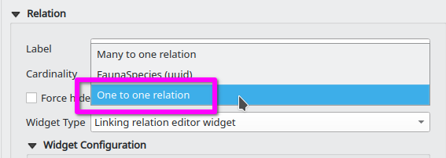
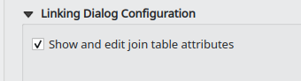

Linking Relation Editor plugin for QGIS
=======================================

This plugin provides a relation editor widget with an alternative linking dialog that looks somewhat like a link manager dialog. features can be linked and unlinked by moving them left and right. The effective link is created or destroyed when the dialog is accepted.

# Configuration

In the attribute form configuration select `Linking relation editor widget` as widget type for a relation. The most options are the same as for the stock QGIS Relation Editor Widget, see the related [documentation](https://docs.qgis.org/3.28/en/docs/user_manual/working_with_vector/vector_properties.html).

## One to one relationship

Linking can be restricted to one linked feature per feature by setting the Cardinality combobox to `One to one relation`.

## Show and edit join table attributes

When this option is enabled, the link manager dialog will show the linked features in a tree structure instead of a simple list. The tree elements can be expanded to show the attribute form of the join feature. That attribute form can be configured as usual in the layer properties of the join layer.
**Note:** If a feature is not respecting the constraints it will not be linked/modified when the dialog is accepted. Other features with valid attributes will still be linked.

